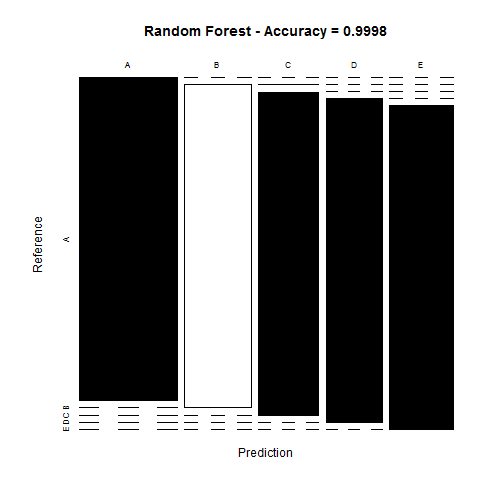
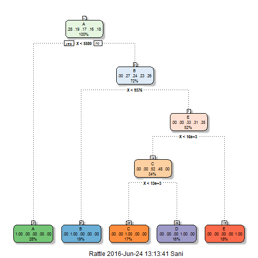
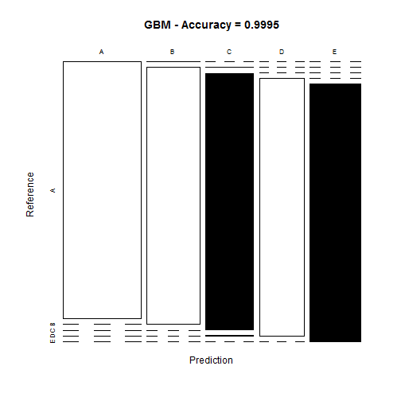

##Overview
The aim of the project is to predict the manner in which 6 participants performed some exercise as described below. This is the "classe" variable in the training set. The machine learning algorithm described here is applied to the 20 test cases available in the test data and the predictions are submitted in appropriate format to the Course Project Prediction Quiz for automated grading.

## Data Loading and Exploratory Analysis
a) Dataset Overview
The training data for this project are available on:
https://d396qusza40orc.cloudfront.net/predmachlearn/pml-training.csv
The test data are available on:
https://d396qusza40orc.cloudfront.net/predmachlearn/pml-testing.csv
The data for this project come from http://groupware.les.inf.puc-rio.br/har. 

### Environment Preparation
We first upload the R libraries that are necessary for the complete analysis.


```r
setwd("~/MachineLearningAssignment")
```

```
## Error in setwd("~/MachineLearningAssignment"): cannot change working directory
```

```r
library(knitr)
library(caret)
```

```
## Loading required package: lattice
```

```
## Loading required package: ggplot2
```

```r
library(rpart)
library(rpart.plot)
library(rattle)
```

```
## Rattle: A free graphical interface for data mining with R.
## Version 4.1.0 Copyright (c) 2006-2015 Togaware Pty Ltd.
## Type 'rattle()' to shake, rattle, and roll your data.
```

```r
library(randomForest)
```

```
## randomForest 4.6-12
```

```
## Type rfNews() to see new features/changes/bug fixes.
```

```
## 
## Attaching package: 'randomForest'
```

```
## The following object is masked from 'package:ggplot2':
## 
##     margin
```

```r
library(corrplot)
```

```
## Error in library(corrplot): there is no package called 'corrplot'
```

```r
set.seed(12345)
```


### Data Loading and Cleaning
The next step is loading the dataset from the URL provided above. The training dataset is then partinioned in 2 to create a Training set (70% of the data) for the modeling process and a Test set (with the remaining 30%) for the validations. The testing dataset is not changed and will only be used for the quiz results generation.

### set the URL for the download

```r
UrlTrain <- "http://d396qusza40orc.cloudfront.net/predmachlearn/pml-training.csv"
UrlTest <- "http://d396qusza40orc.cloudfront.net/predmachlearn/pml-testing.csv"
```


### download the datasets

```r
training <- read.csv(url(UrlTrain))
testing <- read.csv(url(UrlTest))
```

# create a partition with the training dataset

```r
inTrain <- createDataPartition(training$classe, p=0.7, list=FALSE)
TrainSet <- training[inTrain, ]
TestSet <- training[-inTrain, ]
dim(TrainSet)
```

```
## [1] 13737   160
```

```r
dim(TestSet)
```

```
## [1] 5885  160
```


Both created datasets have 160 variables. Those variables have plenty of NA, that can be removed with the cleaning procedures below. The Near Zero variance (NZV) variables are also removed and the ID variables as well.

### remove variables with Nearly Zero Variance

```r
NZV <- nearZeroVar(TrainSet)
TrainSet <- TrainSet[, -NZV]
TestSet <- TestSet[, -NZV]
dim(TrainSet)
```

```
## [1] 13737   106
```

```r
dim(TestSet)
```

```
## [1] 5885  106
```


### remove variables that are mostly NA

```r
AllNA <- sapply(TrainSet, function(x) mean(is.na(x))) > 0.95
TrainSet <- TrainSet[, AllNA==FALSE]
TestSet <- TestSet[, AllNA==FALSE]
dim(TrainSet)
```

```
## [1] 13737    59
```

```r
dim(TestSet)
```

```
## [1] 5885   59
```


# remove identification only variables (columns 1 to 5)
TrainSet <- TrainSet[, -(1:5)]
TestSet <- TestSet[, -(1:5)]
dim(TrainSet)
dim(TestSet)

With the cleaning process above, the number of variables for the analysis has been reduced to 54 only.

## Correlation Analysis
A correlation among variables is analysed before proceeding to the modeling procedures.

```r
corMatrix <- cor(TrainSet[, -54])
```

```
## Error in cor(TrainSet[, -54]): 'x' must be numeric
```

```r
corrplot(corMatrix, order = "FPC", method = "color", type = "lower",
tl.cex = 0.8, tl.col = rgb(0, 0, 0))
```

```
## Error in eval(expr, envir, enclos): could not find function "corrplot"
```

The highly correlated variables are shown in dark colors in the graph above. To make an evem more compact analysis, a PCA (Principal Components Analysis) could be performed as pre-processing step to the datasets. Nevertheless, as the correlations are quite few, this step will not be applied for this assignment.

## Prediction Model Building
Three methods will be applied to model the regressions (in the Train dataset) and the best one (with higher accuracy when applied to the Test dataset) will be used for the quiz predictions. The methods are: Random Forests, Decision Tree and Generalized Boosted Model, as described below. A Confusion Matrix is plotted at the end of each analysis to better visualize the accuracy of the models.

### Method 1: Random Forest
Model fit

```r
set.seed(12345)
controlRF <- trainControl(method="cv", number=3, verboseIter=FALSE)
modFitRandForest <- train(classe ~ ., data=TrainSet, method="rf",
trControl=controlRF)
modFitRandForest$finalModel
```

```
## 
## Call:
##  randomForest(x = x, y = y, mtry = param$mtry) 
##                Type of random forest: classification
##                      Number of trees: 500
## No. of variables tried at each split: 41
## 
##         OOB estimate of  error rate: 0.01%
## Confusion matrix:
##      A    B    C    D    E  class.error
## A 3906    0    0    0    0 0.0000000000
## B    1 2657    0    0    0 0.0003762227
## C    0    0 2396    0    0 0.0000000000
## D    0    0    0 2252    0 0.0000000000
## E    0    0    0    0 2525 0.0000000000
```


Prediction on Test dataset

```r
predictRandForest <- predict(modFitRandForest, newdata=TestSet)
confMatRandForest <- confusionMatrix(predictRandForest, TestSet$classe)
confMatRandForest
```

```
## Confusion Matrix and Statistics
## 
##           Reference
## Prediction    A    B    C    D    E
##          A 1674    0    0    0    0
##          B    0 1138    0    0    0
##          C    0    1 1026    0    0
##          D    0    0    0  964    0
##          E    0    0    0    0 1082
## 
## Overall Statistics
##                                      
##                Accuracy : 0.9998     
##                  95% CI : (0.9991, 1)
##     No Information Rate : 0.2845     
##     P-Value [Acc > NIR] : < 2.2e-16  
##                                      
##                   Kappa : 0.9998     
##  Mcnemar's Test P-Value : NA         
## 
## Statistics by Class:
## 
##                      Class: A Class: B Class: C Class: D Class: E
## Sensitivity            1.0000   0.9991   1.0000   1.0000   1.0000
## Specificity            1.0000   1.0000   0.9998   1.0000   1.0000
## Pos Pred Value         1.0000   1.0000   0.9990   1.0000   1.0000
## Neg Pred Value         1.0000   0.9998   1.0000   1.0000   1.0000
## Prevalence             0.2845   0.1935   0.1743   0.1638   0.1839
## Detection Rate         0.2845   0.1934   0.1743   0.1638   0.1839
## Detection Prevalence   0.2845   0.1934   0.1745   0.1638   0.1839
## Balanced Accuracy      1.0000   0.9996   0.9999   1.0000   1.0000
```


plot matrix results

```r
plot(confMatRandForest$table, col = confMatRandForest$byClass,
main = paste("Random Forest - Accuracy =",
round(confMatRandForest$overall['Accuracy'], 4)))
```




### Method 2: Decision Trees
model fit

```r
set.seed(12345)
modFitDecTree <- rpart(classe ~ ., data=TrainSet, method="class")
fancyRpartPlot(modFitDecTree)
```




prediction on Test dataset

```r
predictDecTree <- predict(modFitDecTree, newdata=TestSet, type="class")
confMatDecTree <- confusionMatrix(predictDecTree, TestSet$classe)
confMatDecTree
```

```
## Confusion Matrix and Statistics
## 
##           Reference
## Prediction    A    B    C    D    E
##          A 1673    0    0    0    0
##          B    1 1138    0    0    0
##          C    0    1 1026    1    0
##          D    0    0    0  963    0
##          E    0    0    0    0 1082
## 
## Overall Statistics
##                                           
##                Accuracy : 0.9995          
##                  95% CI : (0.9985, 0.9999)
##     No Information Rate : 0.2845          
##     P-Value [Acc > NIR] : < 2.2e-16       
##                                           
##                   Kappa : 0.9994          
##  Mcnemar's Test P-Value : NA              
## 
## Statistics by Class:
## 
##                      Class: A Class: B Class: C Class: D Class: E
## Sensitivity            0.9994   0.9991   1.0000   0.9990   1.0000
## Specificity            1.0000   0.9998   0.9996   1.0000   1.0000
## Pos Pred Value         1.0000   0.9991   0.9981   1.0000   1.0000
## Neg Pred Value         0.9998   0.9998   1.0000   0.9998   1.0000
## Prevalence             0.2845   0.1935   0.1743   0.1638   0.1839
## Detection Rate         0.2843   0.1934   0.1743   0.1636   0.1839
## Detection Prevalence   0.2843   0.1935   0.1747   0.1636   0.1839
## Balanced Accuracy      0.9997   0.9995   0.9998   0.9995   1.0000
```


plot matrix results
plot(confMatDecTree$table, col = confMatDecTree$byClass,
main = paste("Decision Tree - Accuracy =",
round(confMatDecTree$overall['Accuracy'], 4)))

### Method 3: Generalized Boosted Model
model fit

```r
set.seed(12345)
controlGBM <- trainControl(method = "repeatedcv", number = 5, repeats = 1)
modFitGBM <- train(classe ~ ., data=TrainSet, method = "gbm",
trControl = controlGBM, verbose = FALSE)
```

```
## Loading required package: gbm
```

```
## Loading required package: survival
```

```
## 
## Attaching package: 'survival'
```

```
## The following object is masked from 'package:caret':
## 
##     cluster
```

```
## Loading required package: splines
```

```
## Loading required package: parallel
```

```
## Loaded gbm 2.1.1
```

```
## Loading required package: plyr
```

```r
modFitGBM$finalModel
```

```
## A gradient boosted model with multinomial loss function.
## 50 iterations were performed.
## There were 80 predictors of which 1 had non-zero influence.
```


prediction on Test dataset

```r
predictGBM <- predict(modFitGBM, newdata=TestSet)
confMatGBM <- confusionMatrix(predictGBM, TestSet$classe)
confMatGBM
```

```
## Confusion Matrix and Statistics
## 
##           Reference
## Prediction    A    B    C    D    E
##          A 1673    0    0    0    0
##          B    1 1138    0    0    0
##          C    0    1 1026    1    0
##          D    0    0    0  963    0
##          E    0    0    0    0 1082
## 
## Overall Statistics
##                                           
##                Accuracy : 0.9995          
##                  95% CI : (0.9985, 0.9999)
##     No Information Rate : 0.2845          
##     P-Value [Acc > NIR] : < 2.2e-16       
##                                           
##                   Kappa : 0.9994          
##  Mcnemar's Test P-Value : NA              
## 
## Statistics by Class:
## 
##                      Class: A Class: B Class: C Class: D Class: E
## Sensitivity            0.9994   0.9991   1.0000   0.9990   1.0000
## Specificity            1.0000   0.9998   0.9996   1.0000   1.0000
## Pos Pred Value         1.0000   0.9991   0.9981   1.0000   1.0000
## Neg Pred Value         0.9998   0.9998   1.0000   0.9998   1.0000
## Prevalence             0.2845   0.1935   0.1743   0.1638   0.1839
## Detection Rate         0.2843   0.1934   0.1743   0.1636   0.1839
## Detection Prevalence   0.2843   0.1935   0.1747   0.1636   0.1839
## Balanced Accuracy      0.9997   0.9995   0.9998   0.9995   1.0000
```


plot matrix results

```r
plot(confMatGBM$table, col = confMatGBM$byClass,
main = paste("GBM - Accuracy =", round(confMatGBM$overall['Accuracy'], 4)))
```



##Applying the Selected Model to the Test Data
The accuracy of the 3 regression modeling methods above are:
a. Random Forest : 0.9963
b. Decision Tree : 0.7368
c. GBM : 0.9839
In that case, the Random Forest model will be applied to predict the 20 quiz results (testing dataset) as shown below.
predictTEST <- predict(modFitRandForest, newdata=testing)

